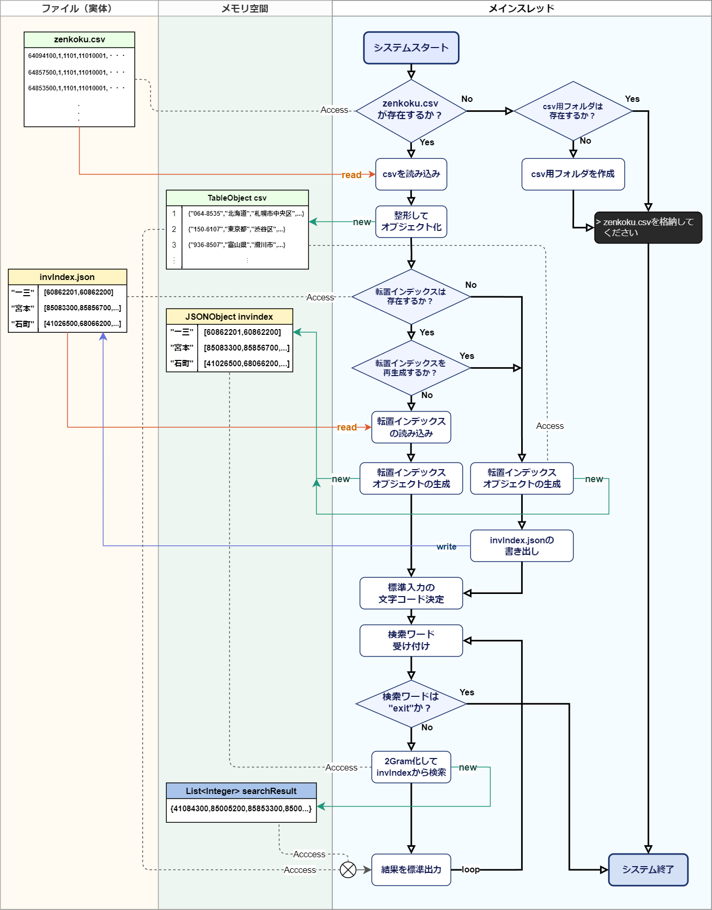

# 技術説明書
### Java言語採用理由
  今回のシステムでJava言語を採用した理由は以下の通りである。
  - #### 静的型付け言語であること  
    今回のシステム要件から、テキストファイルの読み書きやそれらのオブジェクト化、オブジェクトのテキスト化など、複雑な型変換を多く行うことが想定された。そのため、これらの型を厳密に扱うため、またコーディングにおいて実行前の段階でエラーに気づけるため、静的型付け言語であるJavaを採用した。

  - #### クロスプラットフォームであること  
    今回、実行環境の指定がなかったため、どのようなOS環境であっても実行できるコードにしたかった。そのため、JavaVMを介した実行によりOSレベルの違いを吸収し易いJava言語を採用した。  
    同じくJavaScriptもクロスプラットフォームな言語であるため、当初候補に上がっていた。しかし、ファイルの読み書き待ちやユーザーの標準入力待ちなど、同期処理がメインの本システムにおいて、非同期処理をメインとするWEB出身のJavaScriptの性格が合わないことや、動的型付け言語であることなどから、候補から外された。

  - #### オブジェクト指向言語であること
    システム要件から、ファイルの読み書き、文字列のNGram処理、検索処理、標準入出力の処理など、独立した機能が複数必要であることが伺われた。そのため、複雑な機能を分割して開発を円滑にするほか、各機能を疎結合にすることで保守性を高めるといった観点から、オブジェクト指向言語であるJava言語を採用した。
---
### システム全体図  
本システムは、標準入出力を介したコンソールアプリケーションである。  
以下の図にて、本システムの全体像をフローチャートで示す。 

メインの機能は、**「ユーザー入力の文字列から住所を検索して一覧で返す」** 機能であるから、分岐の少ないチャートとなっている。  
全体の流れを一行で表すなら、**「検索機能を実現するために必要な情報が揃っているかを確認し、揃った時点で検索ループを開始する」** といったものになる。



1. #### CSVの所在確認
    本システムでは全国の住所情報をcsvにまとめた、zenkoku.csvを検索元とする。これがないと始まらないので、システムの一番頭でzenkoku.csvが所定の位置にあるかを確認している。  
    ```java
    String csvFilePath = "./csv/zenkoku.csv";
    if (new File(csvFilePath).exists()){
        //ファイルがあった時の処理
    }
    ```
    上記のようにすることでzenkoku.csvの所在を確認している。ここでif文がfalseとなった場合、すなわちcsvファイルが確認できなかった場合、以降のシステムを続行できないため、zenkoku.csvを所定の場所に収めるようにユーザーにアナウンスしてから、システムを終了する。
    - #### CSVフォルダの所在確認
      1.の処理がfalseだった時、ついでにcsvフォルダが存在するかも確認し、なかった場合はcsvフォルダを作成する機能を持っている。これはシンプルにユーザビリティのためだ。

2. #### CSVファイルの読み込み
    ここではScannerオブジェクトを呼び出し、Shift-JISでcsvファイルを一行ずつ読み込んでいる。  
    csvから読み込まれた文字列は、その1行がDBで言うところの1レコードである。これをDBのように扱いたかったため、自作クラスのTableクラスを用意した。main関数内`loadCSV()`では、`Table csv = new Table (csvPath)`としてインスタンスを作成し、`csv.insert()`メソッドを使って一行ずつTableオブジェクトに取り込んでいる。  
    `insert()`メソッドでは、入力された文字列をRecordオブジェクト（自作クラス）としてインスタンス化し、Tableオブジェクト内のRecords配列に保存するという動作が行われている。  
    こうしてcsvファイルはオブジェクト化され、メモリ空間に取り込まれている。

    ところで、zenkoku.csvファイル1行あたり22列のデータを持っているが、取り込まれた後のRecordオブジェクトは最長8要素の長さしか持っていない。これは、システム要件から「郵便番号」「都道府県」「市区町村」「町域」「京都通り名」「字丁目」「事業所名」「事業所住所」ら以外のデータは検索にも表示にも使用されないことがわかっており、取り込み時に捨てているためだ。  
    また、Recordオブジェクトも最長8要素と言った通り、例えば「町域」以降のデータがないレコードについては4要素の長さとなっている。これらの実装は両者とも、メモリをいたずらに消費させないことを意図している。

3. #### 転置インデックスの所在確認
    csvファイルの確認をしたときと同じ手法で転置インデックス(invIndex.json)が存在しているかを確認している。  
    これは、転置インデックスの作成にはそれなりの計算リソースを要するため、例えば2回目以降の起動の際、既存の転置インデックスが存在する場合はあえて転置インデックスを作り直す必要がないからだ。  
    ただし、既存の転置インデックスが存在していたとしても、zenkoku.csvに変更が入っている場合などには再生成が必要となる。そのため、既存の転置インデックスが確認された場合においても再生成するかどうかをユーザーに選択させている。

4. #### 転置インデックスオブジェクトの作成（生成）

    取り込まれたTableオブジェクトのデータを元に、NGramクラスに記述されたメソッドを使用して各レコードごとの2Gram解析結果を生成している。

    この時に使用される、`NGram.makeNGram()`メソッドには第二引数としてNGramのNを渡せるようになっている。今回の2Gramというシステム要件上では必要のない機能であるが、3Gramでも4Gramでも、引数を変えるだけで対応できるように、拡張性を持たせたいという意図で実装した。

    1レコードごとに解析された結果はMapオブジェクトに`{"String":List<Integer>}`という形で保存される。2Gramにより生成された単語（"北海"、"海道"など）をキーとし、対象レコードのIDをMapオブジェクトのvalueにint型のリストで保存していくという仕組みだ。  
    これにより、単語→レコードIDの転置インデックスが完成する。

    最後に、この転置インデックスを保存するため、JSONObjectに変換する。
    保存形式にJSONを採用したのは、`{ キー : [idのリスト]}`というMap型の形式がJSONと相性が良かく、軽量かつ人間でも読める形だったからだ。

5. #### 転置インデックスの保存
    生成した転置インデックスオブジェクトを使い、`String invIndexPath = "./invIndex.json";`にファイルとして保存する。保存されたjsonファイルは次回以降起動した際に読み込まれる。

6. #### 転置インデックスオブジェクトの作成（読み込み）
    転置インデックスが生成されなかった場合、こちらの処理になる。既存のjsonを読み込んでメモリ空間の転置インデックスオブジェクトに入れるだけである。

7. #### 標準入力の文字コード決定
    この後、標準入力を使って検索機能を実行していくことになるが、UNIX系とwindowsでは標準入力の文字コードが異なっている。たとえばUNIX系はUTF-8で標準入力が渡されるが、それをShift-JISとして受け取ってしまうと検索機能が機能しなくなってしまう。  
    このOSレベルでの違いをコード上からハンドリングするのはいささか難しかったため、ユーザーに手動で文字コードを選択してもらい、この問題を回避することとした。

8. #### 検索機能
    メイン機能である。"exit"が入力されるまで検索機能をループで提供し続けるようにした。  
    入力された文字列をNGram.sepString()メソッドで2Gram解析し、解析された単語をキーとしてinvIndexに検索を行い、ヒットしたレコードIDを収集して、それらのIDのレコードを表示するという流れだ。  
    #### 例 (擬似的なコードで厳密ではないです)
    ```java
    String inputString = "北海道"; //入力文字列が北海道だった場合、

    List<String> words = NGram.sepString(inputString,2);
    // words >> {"北海","海道"} となる。

    //北海についてinvIndexから得られた結果は次のようになり、
    JSONArray hokkai = new JSONArray(invIndex.get("北海").toString);
    // hokkai >> {0,1,2,3,4,5,6,7,8,9,10,11,12,13,14,15,16,....}

    //海道について得られた結果は次のようになる。
    JSONArray kaido = new JSONArray(invIndex.get("海道").toString);
    // kaido >> {0,1,2,3,4,5,6,7,8,9,10,11,12,13,14,15,16,....}

    //これらを集めて重複を削除すると最終的な検索結果が得られ、
    List<Integer> searchResult = ( hokkai + kaido )重複を削除
    // searchResult >> {0,1,2,3,4,5,6,7,8,9,10,11,12,13,14,15,16,....}

    //searchResultを使って対応するIDを持つレコードを表示していくと
    print(csv.get(searchResult[0~max]))
    /**
     * 　　　　　　　・・・
     * 〒483-8185　愛知県江南市　大海道町神明
     * 〒483-8186　愛知県江南市　大海道町中里
     * 〒492-8436　愛知県稲沢市　中之庄海道町
     * 〒470-2507　愛知県知多郡武豊町　平海道
     * 　　　　　　　・・・
     * /
    //という結果が得られる。
    ```


---

### 特記事項
csvのオブジェクト化に際し、使用するのは全て固定長のArrayとした。これは、可変長のListに値を追加し続けるより、最初に要素数を全て測ってからArrayにした方が安全だと考えたからだ。  
というのも、Listは後から要素数を追加できる反面、要素が増えるたびにListObjectを再生成するという動きを持っている。廃棄された旧ListはGCが片付けてくれるとはいえ、短時間にかなりの回数（zenkoku.csvは約15万レコード）これを行うとなると、メモリリーク回避の面から固定長で一回で確保したほうが得策と考えた。  

また、検索結果表示の際にはレコードIDを以てcsvのオブジェクトにアクセスすることになるが、このようなランダムアクセスが多いシステムにおいてはindex番号でアクセスができるArrayの方が優位だと考え、このような実装にした。
    
### 反省
コーディング事態はそこまで大変ではなかったが、gradleといったビルドツールを導入したり、配布可能なパッケージにすることに非常に苦労した。というのも、最初からアプリケーションの雛形を作っていたわけではなく、VSCodeにベタ書きでコーディングを行っていたために、動くものが完成してからいざビルド環境で実行しようとするとこれが通らなくて七転八倒した。  
また、文字コードに起因するトラブルがものすごく多く、これの対処にも非常に労力を要した。プロトタイプを気軽に作るにせよ、やはり早い段階でCI環境を整えておくべきだと猛省した。  

コード面に関しては、メモリ節約を意識しながら実装が出来た。しかし、メインクラスであるApp.javaに記載したメソッドがかなり多くなってしまった。オブジェクト指向の観点からすると、もう少し上手に分けられたのではないかと思う。
